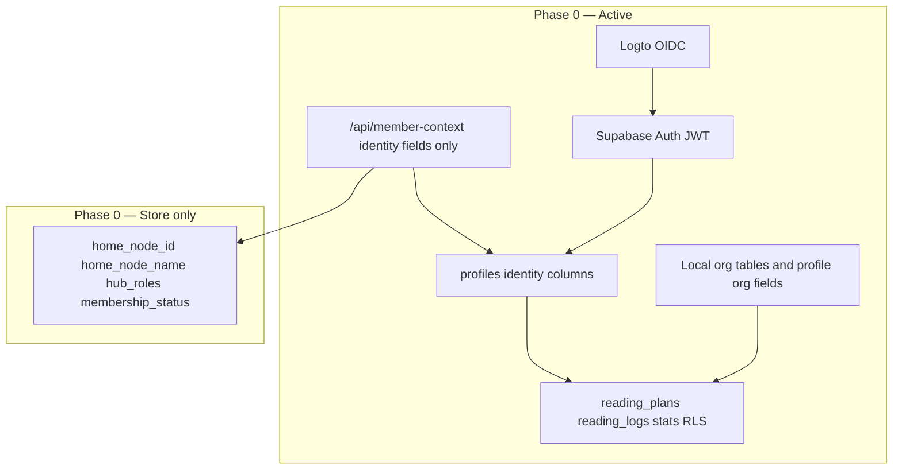
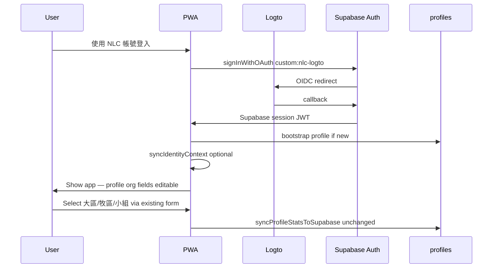

# Phase 0 — NLC Ecosystem Integration Plan

**Status:** Implemented (Phase 0)  
**Scope:** Identity-first integration without changing local org/role logic  
**Audience:** Engineering + NLC IT coordination

---

## 1. Purpose

Phase 0 connects 教會速讀挑戰 to the NLC identity layer so members sign in with the same Logto account used across church services, while **preserving the app’s existing org tree and RBAC** as the runtime source of truth.

This phase is intentionally narrow. Member Hub’s org structure modeling is not complete yet; this app’s `great_regions` → `pastoral_zones` → `small_groups` model and profile-based stats scoping remain authoritative.

### Goals

- NLC SSO login via Supabase custom OIDC (`custom:nlc-logto`)
- Cross-app logout via Logto end-session
- Stable identity anchoring on `profiles` (`identity_provider`, `identity_subject`, `member_id`)
- Store Hub metadata for future use without applying it to stats scope
- Zero regression to existing org admin, profile editing, RLS, and rankings

### Non-goals (defer to Phase 1+)

- Mapping `organization.homeNodeId` → local org FKs
- Hub-driven role projection into `profiles.role`
- `org_fields_locked` / read-only org UI driven by Hub
- `membership_status` or `apps[]` access gating
- Replacing in-app admin role/org management
- Server-side profile sync (recommended in Phase 1)

---

## 2. Architecture boundary



| Concern | Phase 0 owner |
|---------|----------------|
| Who signed in | Logto → Supabase Auth |
| Member cross-reference | Member Hub `identity.*` → `profiles` |
| Display name default | Hub `profile.displayName` **only if profile name empty** |
| Org placement (大區/牧區/小組) | **This app** — unchanged |
| Church RBAC (group_leader, zone_leader, …) | **This app** — unchanged |
| Reading data | Supabase app tables + existing RLS |

---

## 3. Current code gaps (must fix in Phase 0)

The initial integration scaffold goes beyond Phase 0 in these places:

| Location | Current behavior | Phase 0 fix |
|----------|------------------|-------------|
| [`js/auth.js`](../js/auth.js) `applyContextToCurrentUser` | Maps `homeNodeName` → `small_group`, overwrites `role`, sets `org_fields_locked = true` | Split into `applyIdentityContext()` — identity + metadata only |
| [`js/db.js`](../js/db.js) `syncMemberContext` | Upserts org/role fields from Hub-mapped state | Upsert **identity columns only**; never touch `great_region`, `pastoral_zone`, `small_group`, `role` |
| [`js/db.js`](../js/db.js) `bootstrapProfile` | Creates profile with empty org (`未設定`) | Restore user-facing org picker flow; use sensible empty state, not Hub guesses |
| [`js/views/profile.js`](../js/views/profile.js) | Locks org UI when `org_fields_locked` | Remove Hub-driven lock in Phase 0; keep existing editable org form |
| [`api/_lib/member-hub.js`](../api/_lib/member-hub.js) `sanitizeMemberContext` | Returns full context including org/roles | Add `sanitizeIdentityContext()` for Phase 0 API response |
| [`docs/nlc-onboarding.md`](./nlc-onboarding.md) | Requests org/role Hub fields for immediate use | Split into Phase 0 (identity) vs Phase 1 (org/role) field requests |

---

## 4. Implementation tasks

### Track A — NLC IT & Supabase setup (no code)

| # | Task | Owner | Output |
|---|------|-------|--------|
| A1 | Submit Phase 0 registration to NLC IT | Engineering | Logto client for this app |
| A2 | Configure Supabase custom OIDC provider `custom:nlc-logto` | Engineering | Provider live in Supabase dashboard |
| A3 | Set Vercel env vars | Engineering | `LOGTO_*`, `SUPABASE_*`, `APP_BASE_URL` |
| A4 | Apply migration `0010_nlc_ecosystem_profile_fields.sql` | Engineering | Identity columns on `profiles` |
| A5 | **Optional for Phase 0:** request identity-only Hub access | Engineering | `identity.*`, `profile.displayName` only |

**Phase 0 NLC IT request (minimal):**

```txt
Scopes: openid profile email phone
Member Hub fields (Phase 0):
  - identity.provider
  - identity.providerSubject
  - identity.memberId
  - profile.displayName
Deferred to Phase 1:
  - organization.*
  - roles, primaryRole
  - apps
```

Member Hub server token is **optional** in Phase 0. Login works without it; identity columns populate from Logto user metadata where possible.

---

### Track B — Code: identity-only sync

#### B1. Refactor `js/auth.js`

```js
// Phase 0: apply only identity + stored metadata
applyIdentityContext(context, { profileExists, hasLocalName }) {
  // WRITE to runtime state + DB-bound fields:
  //   identity_provider, identity_subject, member_id
  //   membership_status, home_node_id, home_node_name (metadata)
  //   hub_primary_role, hub_roles (metadata, not profiles.role)
  //   member_context_synced_at

  // OPTIONAL name: only if !hasLocalName && displayName

  // DO NOT touch:
  //   great_region, pastoral_zone, small_group, role, org_fields_locked
}
```

Remove or gate `mapPrimaryRoleToAppRole()` — keep function for Phase 1 but do not call it in Phase 0.

#### B2. Refactor `js/db.js`

- Rename `syncMemberContext` → `syncIdentityContext` (or keep name, change behavior)
- Upsert payload Phase 0:

```js
{
  id: userId,
  identity_provider,
  identity_subject,
  member_id,
  membership_status,      // store only
  home_node_id,           // store only
  home_node_name,         // store only
  hub_primary_role,       // store only
  hub_roles,              // store only
  member_context_synced_at,
  name,                   // only when profile name was empty
  // explicitly omit: role, great_region, pastoral_zone, small_group, org_fields_locked
}
```

- `bootstrapProfile`: after insert, call `syncIdentityContext`; user completes org via existing profile form
- `loadUserData`: sync identity if `identity_subject` missing or `member_context_synced_at` stale (e.g. > 24h), not based on `org_fields_locked`
- Revert `syncProfileStatsToSupabase` org-lock branch — always use existing org save path

#### B3. Refactor `js/views/profile.js`

- Remove `orgLocked` Hub-driven UI disable for Phase 0
- Remove `#profile-org-lock-hint` visibility tied to Hub sync (or repurpose as future Phase 1 notice, hidden by default)
- Keep admin role/org management unchanged

#### B4. Refactor API layer

**Option A (preferred, minimal):** Keep `GET /api/member-context` but add response flag:

```json
{
  "ok": true,
  "synced": true,
  "phase": 0,
  "context": {
    "identity": { ... },
    "profile": { "displayName": "..." }
  }
}
```

Strip org/roles/apps from sanitized response until Phase 1.

**Option B:** Add `GET /api/member-identity` alias; client calls that in Phase 0.

Update [`api/_lib/member-hub.js`](../api/_lib/member-hub.js):

```js
function sanitizeIdentityContext(context) {
  return {
    identity: { provider, providerSubject, memberId, email },
    profile: { displayName: context.profile?.displayName ?? null },
    // metadata stored but not applied:
    _deferred: {
      membershipStatus,
      homeNodeId,
      homeNodeName,
      roles,
      primaryRole,
      apps,
    },
  };
}
```

Client **must not** read `_deferred` for RBAC/org in Phase 0 (store via explicit fields if Hub token available).

#### B5. Environment & docs

- Update [`.env.example`](../.env.example): comment that `MEMBER_HUB_SERVICE_TOKEN` is optional in Phase 0
- Update [`docs/nlc-onboarding.md`](./nlc-onboarding.md): Phase 0 vs Phase 1 field matrix
- Update [`docs/supabase-logto-setup.md`](./supabase-logto-setup.md): Phase 0 verification steps
- Update [`scripts/verify-integration.js`](../scripts/verify-integration.js): assert identity-only behavior

---

### Track C — Database (no schema break)

Migration `0010` columns remain. Phase 0 usage:

| Column | Phase 0 use |
|--------|-------------|
| `identity_provider`, `identity_subject`, `member_id` | **Active** — populated on login/sync |
| `membership_status`, `home_node_*`, `hub_*` | **Write-only storage** — not used for RLS/stats |
| `member_context_synced_at` | **Active** — last identity sync timestamp |
| `org_fields_locked` | **Unused** — always `false` in Phase 0 |

Optional comment migration `0011_phase0_comments.sql` (documentation only):

```sql
COMMENT ON COLUMN public.profiles.org_fields_locked IS
  'Reserved for Phase 1 Hub org sync. Phase 0: always false.';
```

No RLS policy changes required.

---

## 5. First-login user journey (Phase 0)



Existing users (Google → Logto migration): match by email or manual NLC IT linking; out of scope unless NLC provides identity merge tooling.

---

## 6. Testing checklist

### Auth

- [ ] Login gate shows「使用 NLC 帳號登入」
- [ ] Logto redirect completes; Supabase session established
- [ ] Logout clears Supabase session and redirects to Logto end-session
- [ ] Demo mode (`?demo=true`) unchanged

### Identity sync

- [ ] New user: `profiles.identity_subject` populated after login
- [ ] Hub token absent: app still works; sync skipped gracefully
- [ ] Hub token present: identity fields stored; org/role **unchanged**

### Org / role preservation

- [ ] Profile form: 大區/牧區/小組 remain editable
- [ ] Admin can assign roles via existing admin UI
- [ ] RLS: group leader sees same scope as before
- [ ] Rankings RPC returns same results for unchanged test data
- [ ] `org_fields_locked` stays `false` for all test users

### Regression

- [ ] Reading log create/read
- [ ] Plan join/leave
- [ ] Devotional notes private to user
- [ ] Announcements admin-only write
- [ ] Global plans admin CRUD
- [ ] Service worker does not cache `/api/*`

---

## 7. Rollout order

| Step | Action | Risk |
|------|--------|------|
| 1 | Apply code changes (Track B) to identity-only behavior | Low — removes aggressive Hub overrides |
| 2 | Deploy to Vercel preview | Low |
| 3 | Configure Supabase OIDC + env vars | Medium — needs NLC IT credentials |
| 4 | Run testing checklist on preview | — |
| 5 | Production deploy | Medium |
| 6 | Migrate existing Google users (if any) | High — plan separately |

**Recommendation:** Ship Track B code **before** enabling Logto in production so early Hub sync cannot lock org fields.

---

## 8. Phase 1 preview (not in scope now)

When Member Hub org modeling is ready:

1. Define `homeNodeId` → local org FK mapping table
2. Enable Hub role projection with explicit mapping spec
3. Set `org_fields_locked = true` only after verified mapping
4. Move sync to server-side upsert (service role)
5. Gate features on `membership_status` and `apps[]`

Phase 0 deliberately stores Hub metadata columns so Phase 1 can activate without another migration.

---

## 9. File change summary

| File | Change |
|------|--------|
| `js/auth.js` | Identity-only apply; deprecate Hub org/role mapping calls |
| `js/db.js` | Identity-only upsert; restore bootstrap org UX |
| `js/views/profile.js` | Remove Hub org lock UI |
| `api/_lib/member-hub.js` | `sanitizeIdentityContext()` |
| `api/member-context.js` | Return Phase 0 subset |
| `docs/nlc-onboarding.md` | Phase 0 vs Phase 1 field requests |
| `docs/supabase-logto-setup.md` | Phase 0 verify steps |
| `scripts/verify-integration.js` | Identity-only assertions |
| `README.md` | Link to this doc |

**No changes:** `supabase/migrations/0001–0009`, RLS policies, org admin functions, stats views, `CHURCH_PLAN_PRESETS`, demo mode.

---

## 10. Success criteria

Phase 0 is complete when:

1. Users sign in with NLC Logto SSO in production
2. `profiles.identity_subject` reliably links Logto users to app profiles
3. Local org tree, profile editing, admin tools, and stats scoping behave **identically** to pre-integration
4. Hub metadata is stored when available but never overrides org/role
5. Documentation reflects Phase 0 boundaries for NLC IT and future engineers
